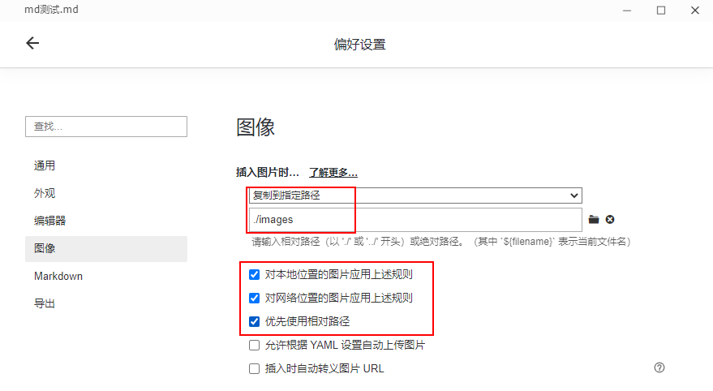

## 文章爬取Bot😎使用介绍

> 防止文章没有看就删除了，所以借用大佬项目，自己用Electron写了个简单的应用，将公众号,知乎,知乎专栏,简书,知否(SegmentFault),掘金,CSDN,V2EX,博客园文章转为 markdown，封装成了应用。

## 外观

## 使用

### 1.粘贴文章url到解析框，回车或点击解析按钮开始解析。

### 2.解析结果在输出框展示，图片会存在图床

下载到本地的方法是typora，偏好设置中进行如下设置：

文章图片就会存到当前目录下的images目录下

## 一起交流

感兴趣的可以关注 **Z2O安全攻防** 公众号回复“**加群**”，添加Z2OBot 小K自动拉你加入**Z2O安全攻防交流群**分享更多好东西。

团队建立了知识星球，不定时更新最新漏洞复现，手把手教你，同时不定时更新POC、内外网渗透测试骚操作。感兴趣的可以加一下。

欢迎Star⭐